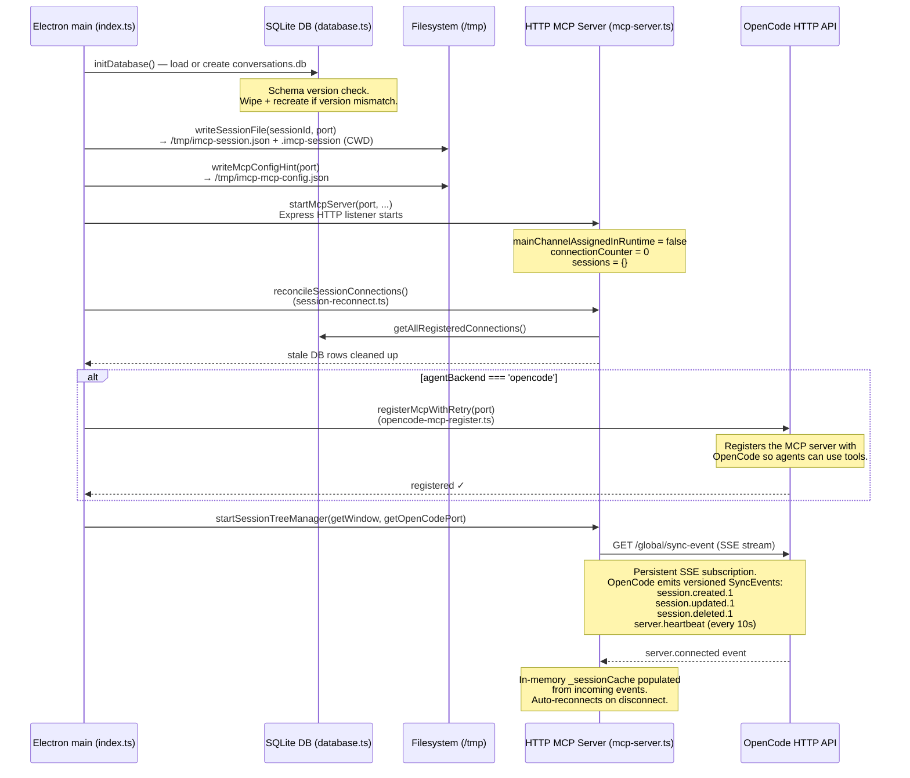
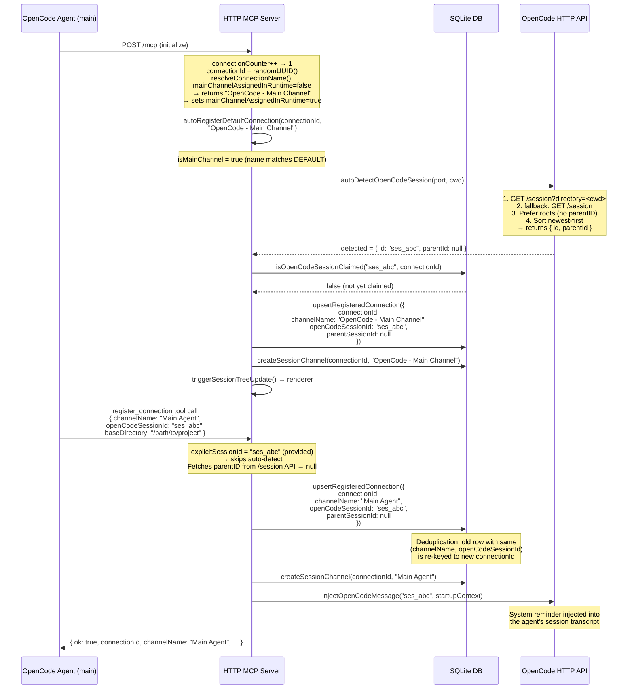
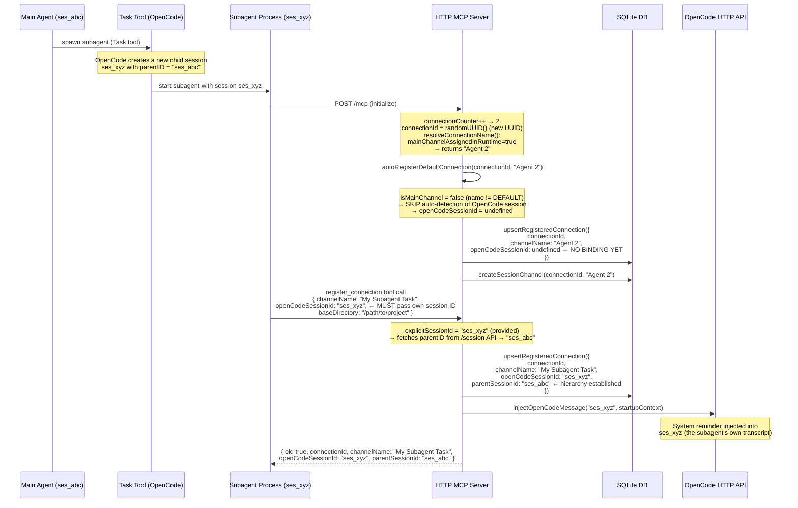
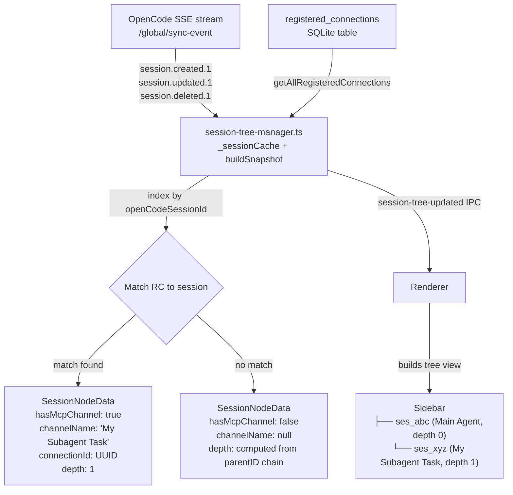
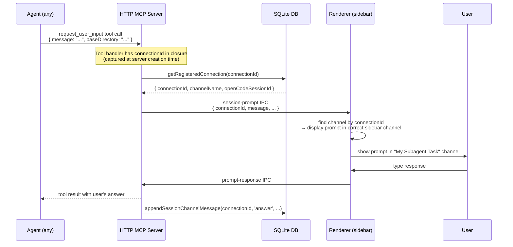
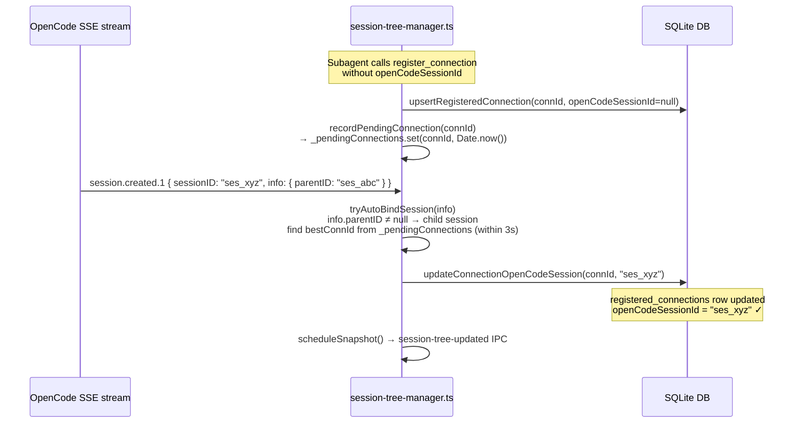

# Session Hierarchy — Interactive MCP Desktop

This document describes exactly how sessions are created, stored, bound, and
displayed from app startup through subagent spawning. A Mermaid diagram is
included for each major phase.

---

## Glossary

| Term                           | Meaning                                                                                          |
| ------------------------------ | ------------------------------------------------------------------------------------------------ |
| `connectionId`                 | UUID generated per MCP transport connection (changes on every reconnect)                         |
| `openCodeSessionId`            | Stable ID of an OpenCode session (e.g. `ses_abc123`). Survives reconnects.                       |
| `parentSessionId`              | The `openCodeSessionId` of the parent OpenCode session (from the OpenCode API)                   |
| `session_channels`             | SQLite table — one row per active MCP transport session                                          |
| `registered_connections`       | SQLite table — the durable identity record binding `connectionId` → `openCodeSessionId`          |
| `DEFAULT_MAIN_CHANNEL_NAME`    | `"OpenCode - Main Channel"` — the hard-coded name for the first connection per server lifetime   |
| `mainChannelAssignedInRuntime` | Boolean flag in the `startMcpServer` closure — resets to `false` on every `softRestartMcpServer` |

---

## Phase 1 — App Startup

---

## Phase 2 — First MCP Client Connection (Main Agent)

---

## Phase 3 — Subagent Spawning

---

## Phase 4 — Session Tree Rendering

---

## Phase 5 — Prompt Routing (Tool Call → Correct Channel)

---

## The Subagent Session Collision Bug

### What goes wrong when `openCodeSessionId` is NOT passed

```mermaid
flowchart TD
    subgraph "❌ BUG PATH — subagent omits openCodeSessionId"
        A["Subagent calls register_connection\nwithout openCodeSessionId"] --> B

        B{"baseDirectory\nprovided?"} -->|yes| C
        B -->|no| G["openCodeSessionId = null\nNo injection target\nStartup context included in tool result only"]

        C["autoDetectOpenCodeSession(port, baseDirectory)\n↳ prefers ROOT sessions (no parentID)\n↳ sorts by newest-first"] --> D

        D{"Is detected session\nalready claimed?"} -->|no — root was already registered\nbut dedup logic ran with OLD connectionId\nSO it appears unclaimed to the new UUID| E
        D -->|yes| G

        E["openCodeSessionId = 'ses_abc'\n← ROOT session, NOT subagent's own ses_xyz"] --> F

        F["injectOpenCodeMessage('ses_abc', startupContext)\n↳ context injected into PARENT's session\n↳ prompts from THIS subagent also land\n   in 'Main Agent' channel\n↳ COLLISION ✗"]
    end

    subgraph "✅ CORRECT PATH — subagent passes own openCodeSessionId"
        H["Subagent calls register_connection\nwith openCodeSessionId: 'ses_xyz'"] --> I
        I["Skip auto-detect\nFetch parentID for ses_xyz → ses_abc"] --> J
        J["openCodeSessionId = 'ses_xyz'\nparentSessionId = 'ses_abc'"] --> K
        K["injectOpenCodeMessage('ses_xyz', startupContext)\n↳ correct session targeted\n↳ prompts appear in subagent's own channel ✓"]
    end
```

### Root cause summary

The collision has **two contributing factors**:

1. **`autoDetectOpenCodeSession` prefers root sessions** (`opencode-session.ts:131`).
   When a subagent omits `openCodeSessionId` but provides `baseDirectory`, the
   auto-detect logic intentionally returns the root session — not the subagent's
   own freshly-spawned session. This means ALL context injection and prompt
   routing is bound to the parent's `openCodeSessionId`.

2. **`isOpenCodeSessionClaimed` check uses the new `connectionId`** as the
   exclusion key (`register-connection.ts:253`, `database.ts:685`).
   After a soft restart or reconnect, a new `connectionId` UUID is generated.
   The deduplication logic therefore sees the root session as "unclaimed" from
   the perspective of this new UUID and allows the binding — even though it was
   previously owned by the root agent's old connection.

### Fix — implemented via SSE auto-bind

The collision is prevented by the SSE-based auto-bind mechanism in
`session-tree-manager.ts`:

1. **`recordPendingConnection(connectionId)`** — called from
   `register_connection` immediately after the DB upsert when no
   `openCodeSessionId` was provided. The connection is placed in a
   `_pendingConnections` ring buffer with a 3-second TTL.

2. **`tryAutoBindSession(info)`** — called every time a
   `session.created.1` SSE event arrives with a `parentID`. It scans
   `_pendingConnections` for the most recently registered unbound connection
   and calls `updateConnectionOpenCodeSession(connectionId, sessionId)` to
   persist the binding.

---

## Storage Layers Summary

| Layer                           | Location                                   | Key                 | Contents                                                                          | Lifetime                                         |
| ------------------------------- | ------------------------------------------ | ------------------- | --------------------------------------------------------------------------------- | ------------------------------------------------ |
| In-memory `sessions` map        | `mcp-server.ts`                            | MCP transport UUID  | `{ connectionId, server, transport }`                                             | Until disconnect / soft restart                  |
| In-memory `_sessionCache`       | `session-tree-manager.ts`                  | `openCodeSessionId` | `SessionInfo` from SSE events (id, parentID, title, directory, timestamps)        | Until app quit or session.deleted.1 event        |
| `session_channels` SQLite       | `conversations.db`                         | `connectionId`      | Channel label, timestamps                                                         | Until `deleteSessionChannel()`                   |
| `registered_connections` SQLite | `conversations.db`                         | `connectionId`      | Full identity record: channelName, openCodeSessionId, parentSessionId, idFilePath | Until `deleteRegisteredConnection()` or DB reset |
| ID file                         | `/tmp/imcp-agent-<name>-<sessionId>.json`  | filename            | connectionId + metadata                                                           | Until `deleteRegisteredConnection()` or DB reset |
| Session file                    | `/tmp/imcp-session.json` + `.imcp-session` | —                   | `{ sessionId, port }` for OpenCode to discover the MCP server                     | Until `clearSessionFile()` (app quit)            |
| MCP config hint                 | `/tmp/imcp-mcp-config.json`                | —                   | Ready-to-paste MCP config                                                         | Until `clearSessionFile()` (app quit)            |
